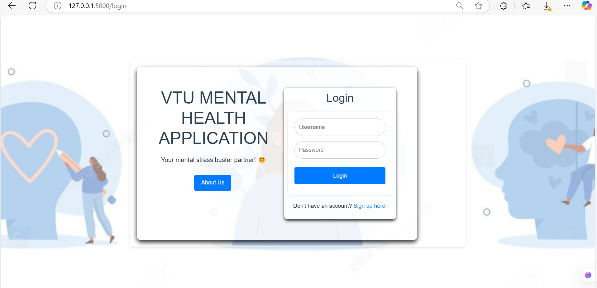
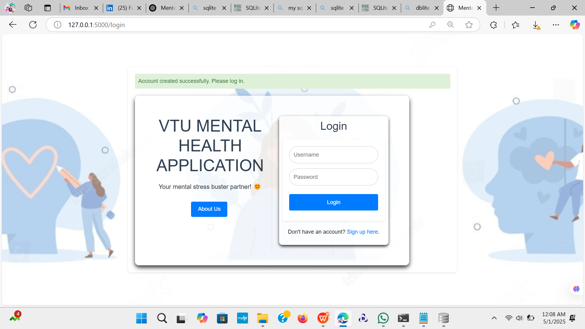
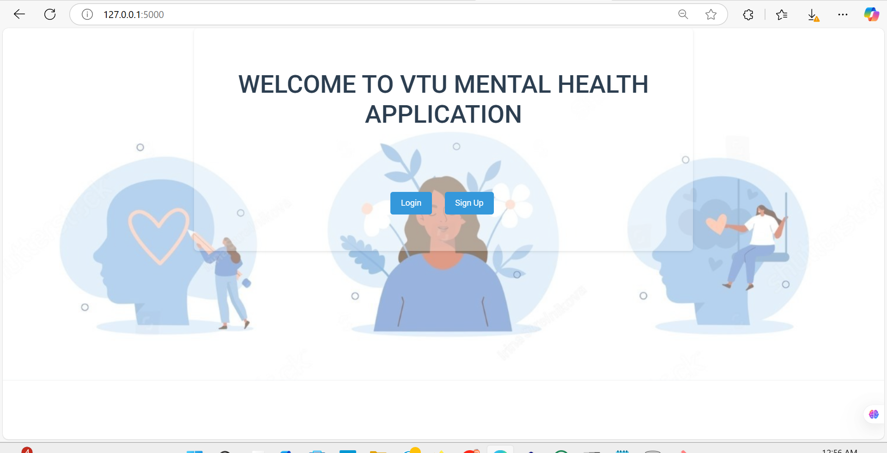
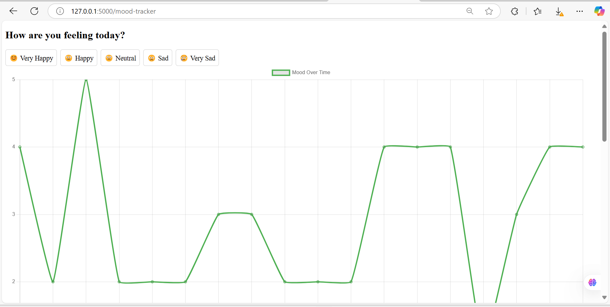

# 🧠 VTU Mental Health Application

## 💡 Title: Automated Early Detection and Intervention System for Mental Health in Educational Institutions

### 📌 Problem Statement
Mental health issues among students are on the rise due to academic pressure, social challenges, and personal struggles. Sadly, many students do not seek or receive help in time due to stigma, lack of awareness, or insufficient resources. This leads to serious consequences such as academic decline, social withdrawal, or worse.

Most current systems are **reactive**, relying on self-reporting or noticeable symptoms. Our solution shifts the paradigm to a **proactive**, **AI-powered** approach for mental health monitoring in educational institutions.

---

## 💡 Our Solution
We developed an intelligent and proactive mental health application tailored for educational institutions. It monitors students' emotional well-being, detects early warning signs using AI and data-driven insights, and provides timely, personalized support through multilingual and multi-modal interaction.

---

## 🧩 Key Features
- 🔐 **Secure Login/Signup System** using PBKDF2 + bcrypt for password hashing
- 📋 **Mental Health Survey** to build emotional profiles of users
- 🤖 **AI Chatbot** (Text and Speech-enabled) for real-time emotional interaction
- 🎵 **Personalized Support Content**:
  - Motivational videos
  - Music playlists
  - Uplifting quotes
  - Light-hearted jokes
- 🌐 **Multilingual Support**:
  - Language detection
  - Translation and transliteration
- 📊 **Sentiment Analysis** for tracking emotional trends and moods
- 🎙️ **Speech Recognition** powered by Web Speech API for hands-free interaction

---

## 🛠️ Technology Stack

| Layer        | Technologies Used                                      |
|--------------|--------------------------------------------------------|
| **Frontend** | HTML, CSS, JavaScript (Responsive & Interactive UI)   |
| **Backend**  | Python, Flask (RESTful APIs, quick iteration)         |
| **Database** | SQLite (via DB Browser – lightweight, serverless)     |
| **AI/ML**    | NLP, Rule-based Detection, Sentiment Analysis         |
| **Security** | Werkzeug, PBKDF2 + bcrypt (Password Encryption)       |

---

## 📸 Screenshots & Demo
## 📸 Screenshots

### 🔐 Sign In Page


---

### 🆕 Sign Up Page


---

### 🏠 Home / Front Page


---

### 📋 Mental Health Survey
![Survey] (survey.png)

---

### 📈 Mood Tracker Dashboard


---

### 🤖 Chatbot & User Updates
![Chatbot] (chat.png)
![user Updates] (user updates.png)
![Daily Schedules] (daily plans.png)
![Relaxation exercise] (breathing.png)

---


---

### 🗃️ Database View – DB1- shows user details
![DB1]  (db1.png)

---

### 🗃️ Database View – DB2- shows daily planning database of user.
![DB2] (db2.png)

---

---

## 🚀 How to Run Locally

```bash
# 1. Clone the repository
git clone https://github.com/P-PRIYA-VARSHA/VTU-Mental-Health-Application.git
cd VTU-Mental-Health-Application

# 2. (Optional) Create a virtual environment
python -m venv env
source env/bin/activate  # On Windows: env\Scripts\activate

# 3. Install dependencies
pip install -r requirements.txt

# 4. Run the Flask app
python app.py

# 5. Open in browser
Visit http://localhost:5000


